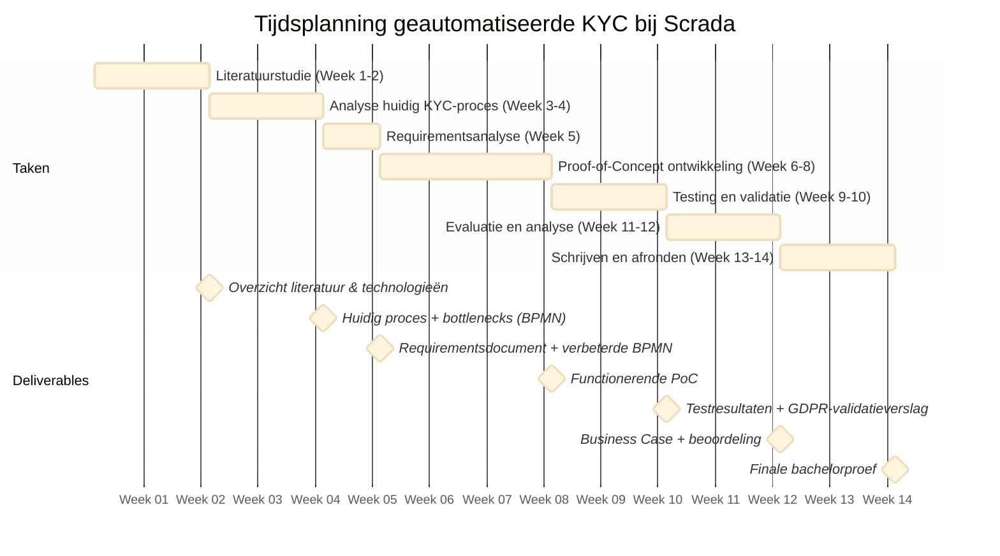

```mermaid
%%{init: {"theme": "base", "themeVariables": {"gridColor": "transparent"}}}%%
gantt
    title Tijdsplanning geautomatiseerde KYC bij Scrada
    dateFormat YYYY-MM-DD
    axisFormat Week %W
    tickInterval 1week
    todayMarker off

    section Taken
    Literatuurstudie (Week 1-2)                    :lit, 2025-01-06, 14d
    Analyse huidig KYC-proces (Week 3-4)           :ana, after lit, 14d
    Requirementsanalyse (Week 5)                   :req, after ana, 7d
    Proof-of-Concept ontwikkeling (Week 6-8)       :poc, after req, 21d
    Testing en validatie (Week 9-10)               :test, after poc, 14d
    Evaluatie en analyse (Week 11-12)              :eval, after test, 14d
    Schrijven en afronden (Week 13-14)             :schrijf, after eval, 14d

    section Deliverables
    Overzicht literatuur & technologieën                           :milestone, m1, after lit, 0d
    Huidig proces + bottlenecks (BPMN)                             :milestone, m2, after ana, 0d
    Requirementsdocument + verbeterde BPMN                         :milestone, m3, after req, 0d
    Functionerende PoC                                             :milestone, m4, after poc, 0d
    Testresultaten + GDPR-validatieverslag                         :milestone, m5, after test, 0d
    Business Case + beoordeling                                    :milestone, m6, after eval, 0d
    Finale bachelorproef                                           :milestone, m7, after schrijf, 0d
```